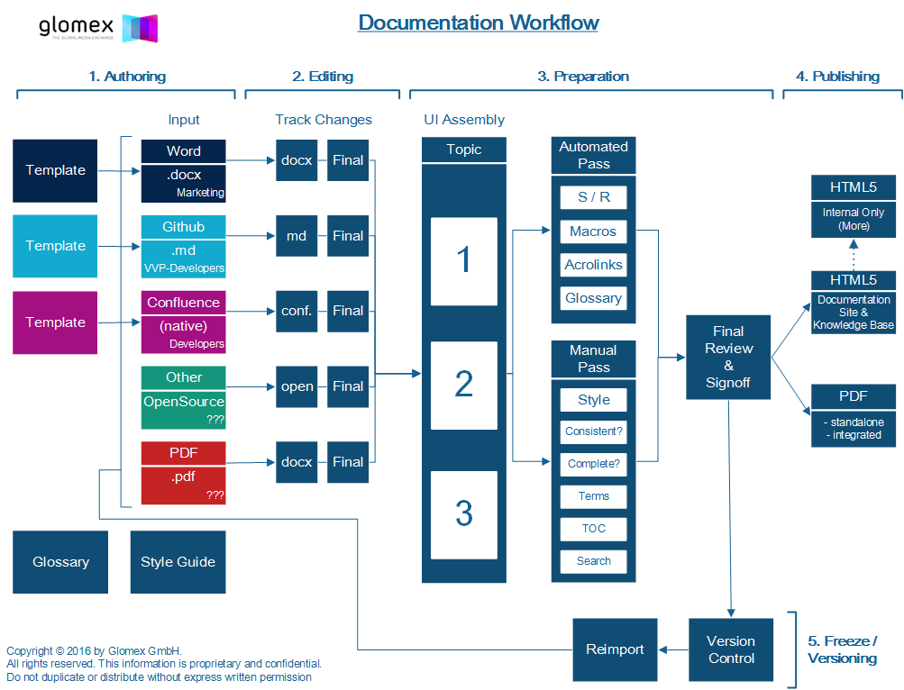

# Documentation Workflow
This topic describes the process you need to follow to contribute to glomex docs.  A diagram of the overall workflow is also provided for your information.

## Step by Step Process to Create glomex docs

As a VVS developer the steps you need to follow are:

1. Select the most appropriate template as a starting point.
2. Edit the template.  Remove template instructions.  Add your own text.
3. Save and version your files.  Dan is notified automatically.
4. Dan will do a first pass edit of your file.  You are notified automatically.
5. Accept or reject the changes.  Discuss any issues with Dan.
6. Dan will email a FINAL APPROVAL version of all your docs to you in HTML format.
7. Please review and signoff on the documents.  Send Dan an email.

That's it.  Within a few hours you will see your new docs on the glomex docs site!

## Documentation Workflow

Here's a diagram of the overall workflow process.  You are involved primarily in phase 1 and phase 2 -- authoring and editing.

 

