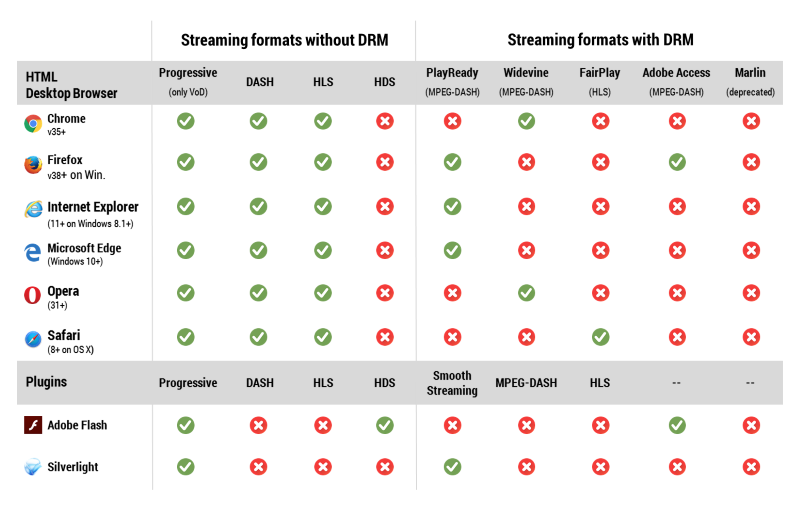

# Player Formats
This topic describes the various streaming formats that are currently supported by the player.  This includes streaming formats with and without Digital Rights Management (DRM).

## Browser Formats

The table below shows the HTML desktop browser and plugin formats that are currently supported.

 

 **[Download](assets/formats.pdf) a PDF Brochure That Includes this Table**

## Mobile Formats

Table of Mobile Formats.

## Set-top Boxes and Casting

Table of Set-top Boxes and casting.

