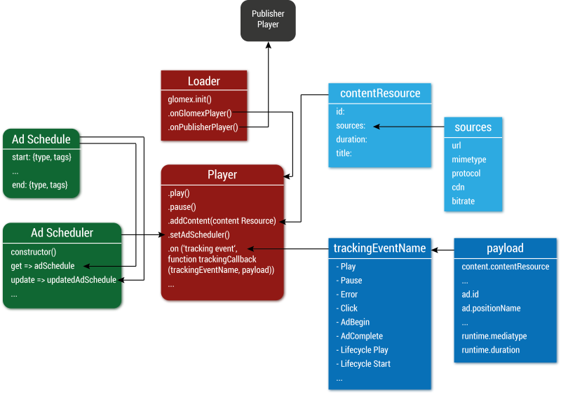

# Player Object Model

The diagram below illustrates the key glomex objects and their relationships.  The diagram also highlights some of most important functions and methods of objects.  For data tables, the most important data attributes are shown.

## Summary Object Model

 **[Download](assets/pdfoomodel.pdf) a PDF of the Object Model**

## Detailed Object Model

Click here to display a detailed view of the object model with all methods.

