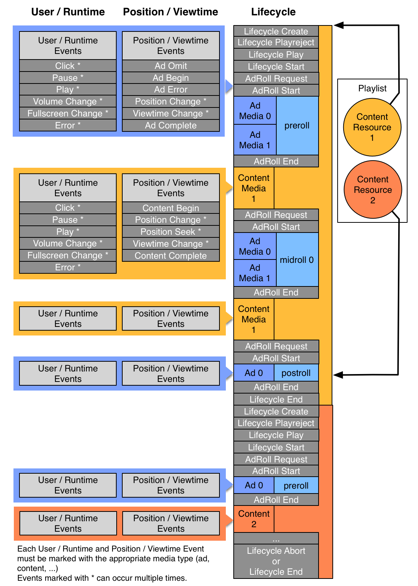

# Diagram: Event Tracking
The previous topic itemized the various `trackingevents` that the player transmits.  This chapter provides a diagram to illustrate how user/runtime events relate to position/viewtime events and to the overall Lifecycle. 

## Reading the Diagram
To read the diagram below, note the following conventions:

* The *User / Runtime* column on the left indicates user-initiated events.
* The *Position / Viewtime* column in the middle indicates system events.
* The *Lifecycle* column on the right indicates overall lifecycle events.
* An asterisk (*) indicates an event that can occur multiple times.
* Blue shading indicates actions beore a Content Resource is involved.
* Orange shading indicates events related to a sample Content Resource 1
* Dark orange shading indicates events related to a sample Content Resource 2

## Tracking Events Process Flow Diagram
The diagram below illustrates the tracking events process flow:

